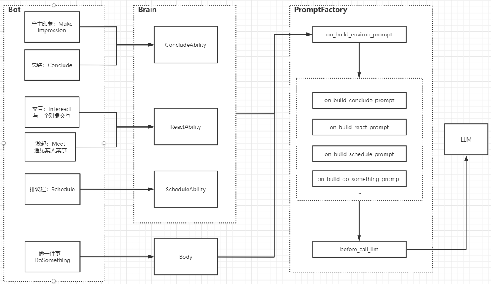
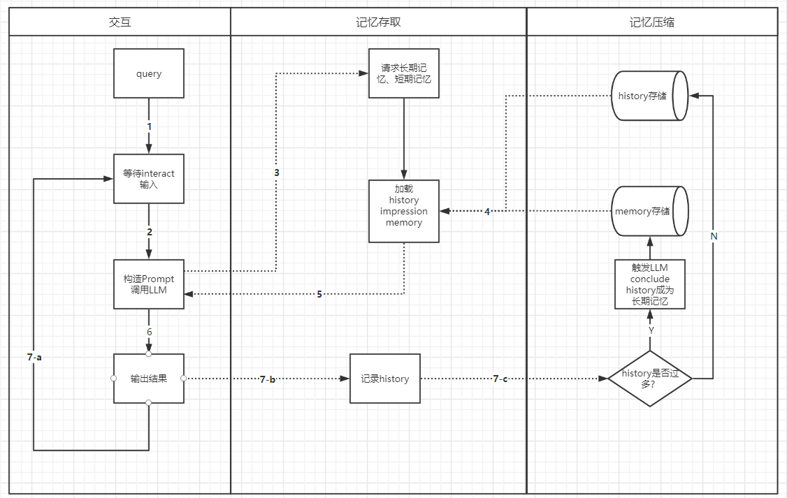
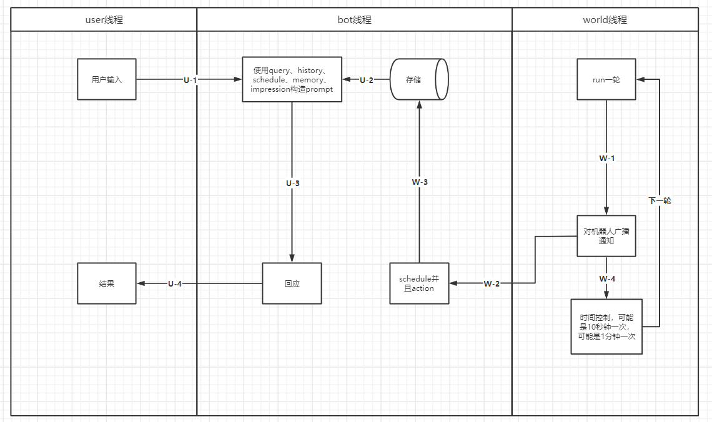

# CyberNexus

我们在构建一个虚拟世界，借助大语言模型的“自然语言处理能力”和有限的"推理能力"来驱动整个世界中角色们的运作。

角色被赋予了思考、记忆的能力，可以和世界中的其他角色进行交流。你可以在 [这个聊天记录](./showcase/sample_conversation.md)
中看到基础的角色之间是如何“活过来”为了自己的目的进行交流的。

# 运作原理

## 关键机制 (toDo)

角色：

1. 规划
2. 交互
2. 记忆
2. 反思

世界：

1. 底层循环
2. 大循环
3. 资源管理

## 运转逻辑

# 技术架构 (toDo)
Bot的模块结构，下面这张图解释了机器人的模块结构
1. Bot: 机器人的外壳，整合了Brain和Body
2. Brain: 机器人的大脑，具备各种各样的能力，例如: 回应能力 交互能力等
3. Body: 机器人的身体，可以使用tools去做某些事情
4. PromptFactory: 最底层的prompt构造器，具备事件链和各种事件，用来响应当bot做到动作或者被环境影响时，bot该如何应对，可以根据bot扮演角色的性格、bot对某些事的印象和bot的知识构造出prompt给到LLM从而得出不同的反应。

记忆的处理方法，正是记忆模块使得CyberNexus区别于一般的ChatBot，下面这张图解释了机器人的记忆模块是如何运作的
当角色（这个角色可以是human可以是bot）与bot交互的时候，会产生对话记录，history。history存储于记忆模块中，作为短期记忆，超过一定程度以后会被要求压缩，总结成一段记忆，存储到长期记忆中。

构建一个能感知世界且实时自驱动的机器人

# 功能清单

- [x] 世界的基础运转能力
- [x] 创建角色，以及对应的 bot
- [x] 角色的记忆和反省能力
- [x] 与角色聊天
- [x] 两个角色之间互动聊天
- [ ] 角色察觉周围环境的能力 (Tools)
- [ ] 角色思考决策的能力
- [ ] 虚拟社区构建，社区资源设置和管理
- [ ] 社区角色之间的沟通交互，世界运作
- [ ] 可视化：角色交互和资源使用
- [ ] 角色的虚拟形象
