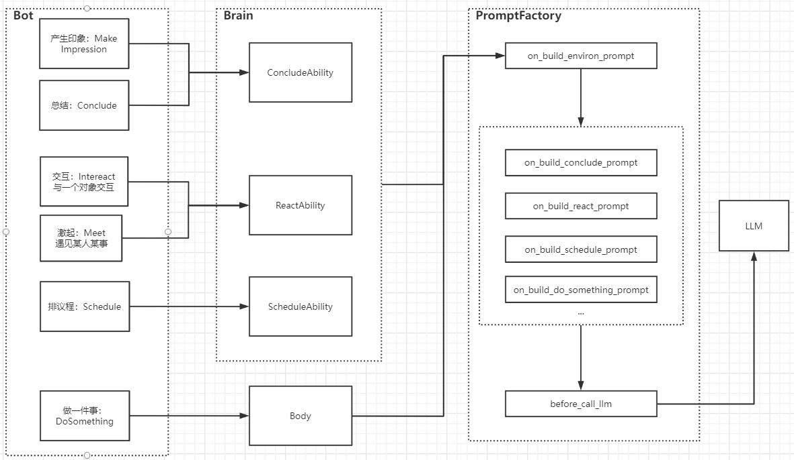
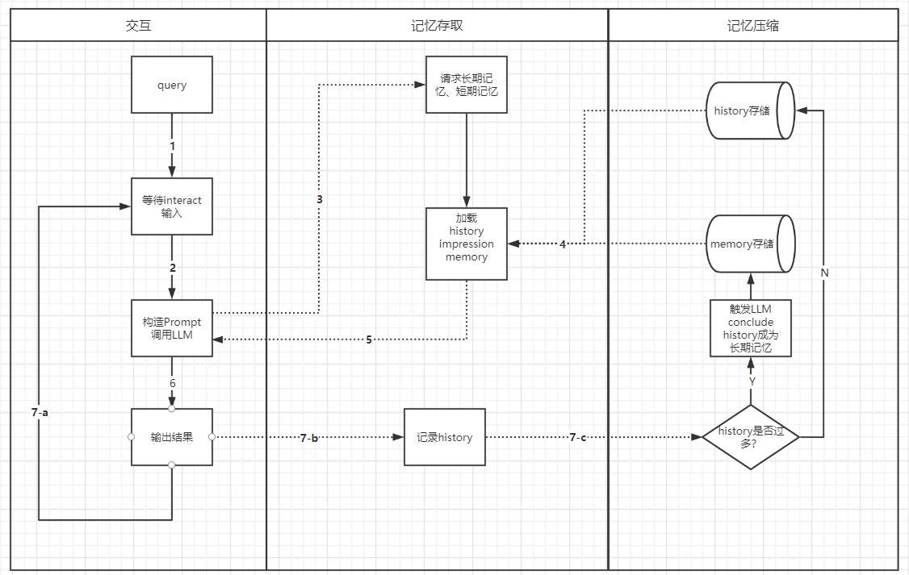

# CyberNexus
English | [简体中文](./README.md)

We are building a virtual world, utilizing the "natural language processing capabilities" of large language models and limited "reasoning abilities" to drive the functioning of characters within the world.

Characters are endowed with the abilities to think and remember, and can interact with other characters in the world. You can see how the basic characters “come to life” and communicate for their own purposes in [this chat log](./showcase/sample_conversation.md).

# Operating Principles

## Key Mechanisms (toDo)

Characters:

1. Planning
2. Interaction
3. Memory
4. Reflection
5. Tools

World:

1. Base Loop
2. Macro Loop
3. Resource Management

## Quick Start
This project is developed using Python 3.11. Before starting, I strongly recommend setting up a venv to try running
```shell
pip install -r requirements.txt
```

```shell
# This is a demo of two characters interacting, character settings are in tool_build_character.py
# GPT-3 is used by default, but you can switch to GPT-4 for more lively conversations, though it might be more expensive :)
export openai_api_key="{your openai api key}"; python ./bot_interaction.py
```

If you don't want to run it and just want to see the effects, you can find some of our debugging records in [this chat log](./showcase/sample_conversation.md). In this case, we have set the characters' personalities, thinking styles, goals, and physical appearances, so you can see that their behaviors are very lively. They may even size each other up, greet each other based on their features, and perform simple actions such as handshakes, greetings, nods, smiles, and displaying documents, etc.

## Operational Logic


# Technical Architecture 
Bot module structure, the following image explains the module structure of the robot:
1. Bot: The robot's shell, integrating Brain and Body
2. Brain: The robot's brain, possessing various abilities, such as: response capability, interaction ability, etc.
3. Body: The robot's body, able to use tools to perform certain tasks
4. PromptFactory: The fundamental prompt constructor, with event chains and various events, to respond when the bot performs actions or is affected by the environment. It can create prompts for the LLM, resulting in different reactions based on the bot's role, impressions, and knowledge.



Memory processing method, the memory module is what sets CyberNexus apart from ordinary ChatBots. The following image explains how the robot's memory module operates. When a character (either human or bot) interacts with the bot, dialogue records, or history are created. History is stored in the memory module as short-term memory and, when reaching a certain level, it is compressed and summarized into a long-term memory.




Building a sentient, self-driven robot in real time


# Feature List

- [x] Basic world operation capability
- [x] Creation of characters and corresponding bots
- [x] Characters’ memory and reflection abilities
- [x] Chatting with characters
- [x] Interaction between two characters
- [ ] Ability for characters to perceive their surroundings (Tools)
- [ ] Characters’ decision-making ability
- [ ] Building of virtual communities, community resource setting, and management
- [ ] Communication and interaction between community characters, world operation
- [ ] Visualization: character interaction and resource use
- [ ] Virtual appearances of characters
